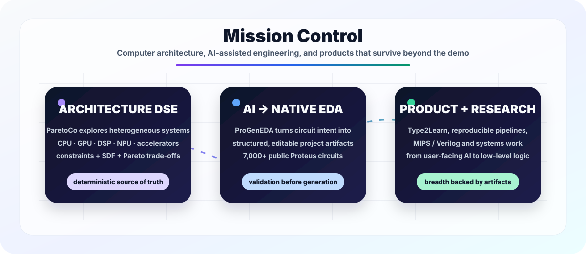
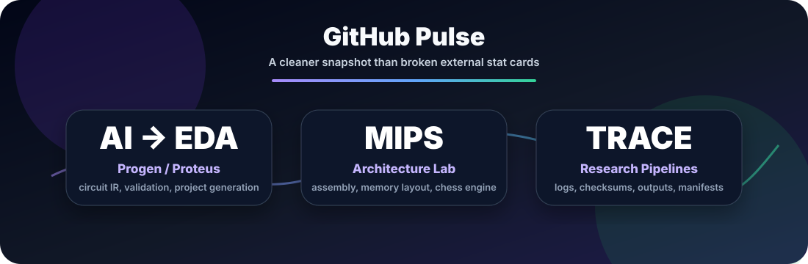
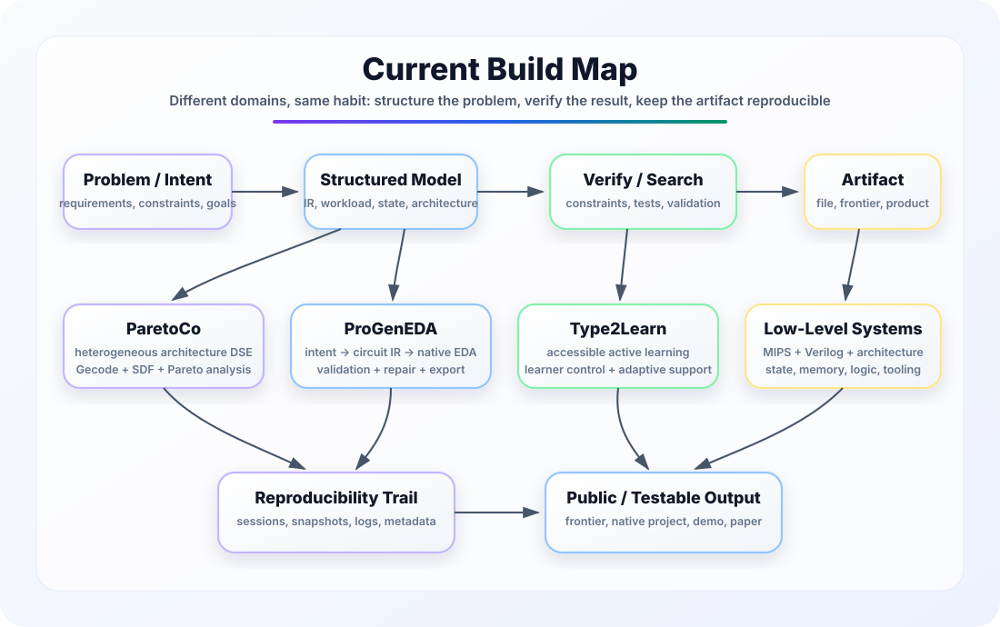

<div align="center">

<h1>Muhammad Taha Bin Zaeem</h1>

<p><strong>Computer Engineering @ NUST CEME</strong> &nbsp;·&nbsp; Pakistan</p>

<p>
  Founder &amp; lead developer of <a href="https://progeneda.app"><strong>ProGenEDA</strong></a>
  &nbsp;·&nbsp;
  Founder &amp; product lead at <a href="https://type2learn.tech"><strong>Type2Learn</strong></a>
</p>

<p>Building editable native EDA projects and accessible, typing-based active learning.</p>

<a href="https://progeneda.app">
  
</a>
<a href="https://type2learn.tech">
  
</a>



<br/>
<br/>

<a href="https://www.linkedin.com/in/muhammad-taha-bin-zaeem-a29524377/">
  
</a>
<a href="https://github.com/MuhammadTahaBinZaeem">
  
</a>
<br/>
<br/>


</div>

---

<div align="center">

### Build the file. Prove the artifact. Keep the work editable.

</div>

---

## 🛰️ Mission Control

<div align="center">



</div>

---

## 🧬 Identity

```txt
Name        : Muhammad Taha Bin Zaeem
Location    : Pakistan
University  : NUST CEME
Field       : Computer Engineering
Build Mode  : AI + circuit simulation + architecture + research pipelines
North Star  : Turn hard technical ideas into testable engineering artifacts
```

I am not trying to look like a generic developer profile.

I build from the uncomfortable edge: where AI has to create real files, where simulators refuse to cooperate, where assembly becomes a full project, where research needs logs instead of vibes, and where a prototype must survive actual testing.

<div align="center">

> **I like systems that are hard enough to expose weak thinking.**

</div>

---

## 🚀 Flagship Work

<table>
<tr>
<td width="50%" valign="top">

### 🔌 ProGenEDA
**EDA automation that turns supported circuit intent into editable native project files.**

Natural language goes in. Strict circuit IR is produced. Local validation and repair run. A downloadable `.pdsprj` comes out.

**Why it matters:** this is not another chatbot wrapper. It is an attempt to make AI produce simulator-ready engineering artifacts.

`FastAPI` · `CircuitIR` · `Proteus` · `MongoDB` · `Docker` · `LLM pipeline`

</td>
<td width="50%" valign="top">

### ⌨️ [Type2Learn](https://type2learn.tech)
**Accessible active learning built around typing, learner choice, and clear feedback.**

Type2Learn pairs structured courses with learner-controlled supports, including narration, alternative input, and focus controls. Typing is a way to show learning—not a speed test.

**Why it matters:** accessible learning should preserve learner agency while making active participation practical.

`Accessible learning` · `Learning design` · `Learner controls` · `Active practice` · `Product direction`

</td>
</tr>
<tr>
<td width="50%" valign="top">

### ♟️ MIPS Chess Engine
**A functional chess engine written in MIPS assembly.**

Board representation, coordinate move input, move validation, special rules, check/checkmate detection, and a simple AI opponent.

**Why it matters:** assembly stops being theory when it has to hold a game state and enforce rules.

`MIPS` · `SPIM` · `Assembly` · `Game logic` · `Memory layout`

</td>
<td width="50%" valign="top">

### ∞ Project Infinity
**A local-first context and workflow system.**

A serious app architecture around project files, context packs, searchable local data, explicit user approval, redaction, provider routing, and reproducible handoff flows.

**Why it matters:** AI workflows need memory, structure, consent, and traceability — not just another text box.

`Electron` · `SQLite` · `TypeScript` · `Local-first design` · `Context systems`

</td>
</tr>
<tr>
<td width="50%" valign="top">

### 📚 Litpaper
**Research pipeline built around reproducibility.**

Raw sources, deterministic scripts, prompt templates, stored LLM outputs, metadata, checksums, and environment records.

**Why it matters:** if a paper depends on LLM outputs, the pipeline must preserve the evidence trail.

`Research engineering` · `Metadata` · `Checksums` · `LLM outputs` · `Auditability`

</td>
<td width="50%" valign="top">

### 🧩 AutoDecomp
**A local workflow for turning opaque binaries into readable technical maps.**

It preserves folder structure, runs controlled analysis, writes structured outputs, records failures, and treats tooling as a repeatable engineering process instead of a one-time stunt.

**Why it matters:** real computer engineering means being able to move from black-box behavior toward understandable structure.

`Python` · `Ghidra` · `Binary analysis` · `Structured output` · `Local tooling`

</td>
</tr>
</table>

---

## 🧠 What My Repos Say About Me

<div align="center">

| Signal | Evidence |
|---|---|
| 🔥 **I build beyond coursework** | AI circuit generation, MIPS chess, context systems, research pipelines |
| ⚙️ **I care about real artifacts** | `.pdsprj` output, Docker deployment, SQLite storage, generated manifests |
| 🧪 **I care about reproducibility** | checksums, stored outputs, metadata, locked baselines, audit docs |
| 🧱 **I like low-level thinking** | MIPS assembly, simulator design, memory layout, architecture experiments |
| 🌐 **I can ship products too** | ProGenEDA native-file workflows and Type2Learn accessible active-learning experiences |

</div>

---

## 🛠️ Arsenal

<div align="center">

### Languages


### AI / Data / Research


### Web / App / Infra


### Engineering Tools


</div>

---

## 📊 GitHub Pulse

<div align="center">



</div>

---

## 🏗️ Current Build Map

<div align="center">



</div>

---

## 📌 Selected Work

<div align="center">

| Repository | What it represents |
|---|---|
| [ProGenEDA](https://progeneda.app) | EDA automation platform for editable native circuit project files |
| [Type2Learn](https://type2learn.tech) | Accessible, typing-based active learning |
| [`autodecom`](https://github.com/MuhammadTahaBinZaeem/autodecom) | Local automation workflow for structured technical analysis outputs |
| [`Mips_Chess_Engine`](https://github.com/MuhammadTahaBinZaeem/Mips_Chess_Engine) | Chess engine built in MIPS assembly |
| [`PROJECTINFINITY`](https://github.com/MuhammadTahaBinZaeem/PROJECTINFINITY) | Local-first AI context/workflow system |
| [`CS-117-Project`](https://github.com/MuhammadTahaBinZaeem/CS-117-Project) | Single-cycle Verilog CPU with scalar and vector operations |
| [`FOP-Project`](https://github.com/MuhammadTahaBinZaeem/FOP-Project) | C++ symbolic algebra solver with an AST-based simplification pipeline |

</div>

---

## 🧭 What I’m Chasing

<div align="center">

<table>
<tr>
<td align="center"><b>Short Term</b></td>
<td>Make AI-generated simulation files reliable enough to trust.</td>
</tr>
<tr>
<td align="center"><b>Medium Term</b></td>
<td>Build publishable research pipelines with clean evidence trails.</td>
</tr>
<tr>
<td align="center"><b>Long Term</b></td>
<td>Become the kind of engineer who can move between software, hardware, AI, and systems without fear.</td>
</tr>
</table>

</div>

---

## 🧨 Personal Operating System

```yaml
rules:
  - build first, polish second, document before forgetting
  - vague ideas are uncompiled specifications
  - if a system cannot be tested, it is still mostly imagination
  - if research cannot be audited, it is only a story
  - do not worship tools; make them serve the goal
```

---

<div align="center">

### “A spark of impenetrable darkness flashed within the concealed of the concealed.”

</div>
